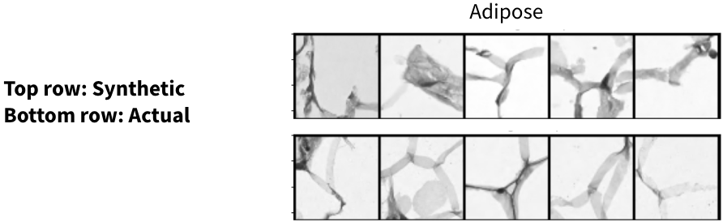
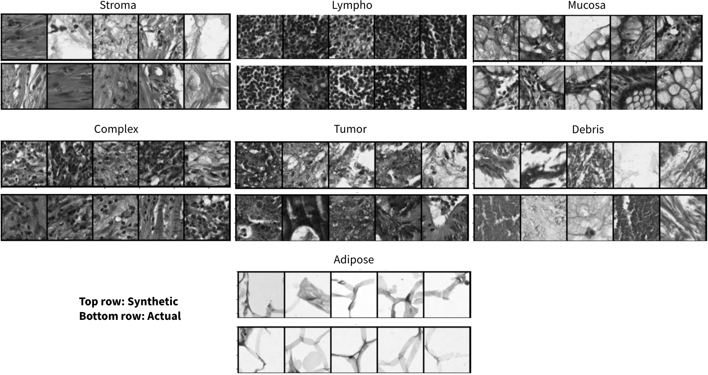

# Improved Generation of Synthetic Imaging Data Using Feature-Aligned Diffusion
This repository contains code for _feature-aligned diffusion_ for generation of synthetic imaging data, specifically, synthetic histological images of colorectal cancer. _Feature-aligned diffusion_ improves the quality of synthetic generations by aligning the intermediate features of the diffusion model to the output features of an "expert" model. The expert model in this case is trained to perform classification on the original dataset.

For more details, please see our paper here: [TBD] - we show that feature-aligned diffusion leads to about *9% improvement* in quality of the synthetic generations over baseline approaches.



## Getting Started
Install requirements using `pip install -r requirements.txt` and download the dataset used in this repository from [here](https://www.kaggle.com/datasets/user322312312/kather-texture-2016-image-tiles-5000-1). The following command will perform vanilla fine-tuning of a diffusion model. By default, we fine-tune a tiny stable diffusion model from HuggingFace [segmind/tiny-sd](https://huggingface.co/segmind/tiny-sd).
```
python train_sd.py \
    --config config.yml \
    --num-img-gens 5 \
    --do-train
```
Relevant arguments (e.g., dataset folder location) can be changed in `config.yml`.

## Running Feature-aligned Diffusion
There are two key steps here: 
- Fine-tune the expert model to perform classification.
- Fine-tune the feature-aligned diffusion model using the expert model.

### Fine-tune an Expert Model
By default, we use ResNet50 as our expert, pre-trained on ImageNet-1k. We fine-tune this model to perform classification on our dataset using the following command:
```
python main.py \
    --config config.yml
```

### Fine-tune a Diffusion Model Using Feature-aligned Diffusion
To fine-tune a diffusion model, with the above expert, use the following command:
```
python train_sd.py \
    --config config.yml \
    --num-img-gens 5 \
    --do-train \
    --use-feature-alignment
```
The expert model checkpoint to be used is specified in `config.yml`. 

## Results
Following are synthetic generations with feature-aligned diffusion compared to the baseline images extracted from the original dataset.


## Citation
If you found this repository useful, please consider citing the following:
```
@inproceedings{
nair2024improved,
title={Improved Generation of Synthetic Imaging Data Using Feature-Aligned Diffusion},
author={Lakshmi Nair},
booktitle={International Workshop on Vision-Language Models for Biomedical Applications},
year={2024},
url={https://openreview.net/forum?id=C71rhsmCOA}
}
```
